# 01 - MakeHuman

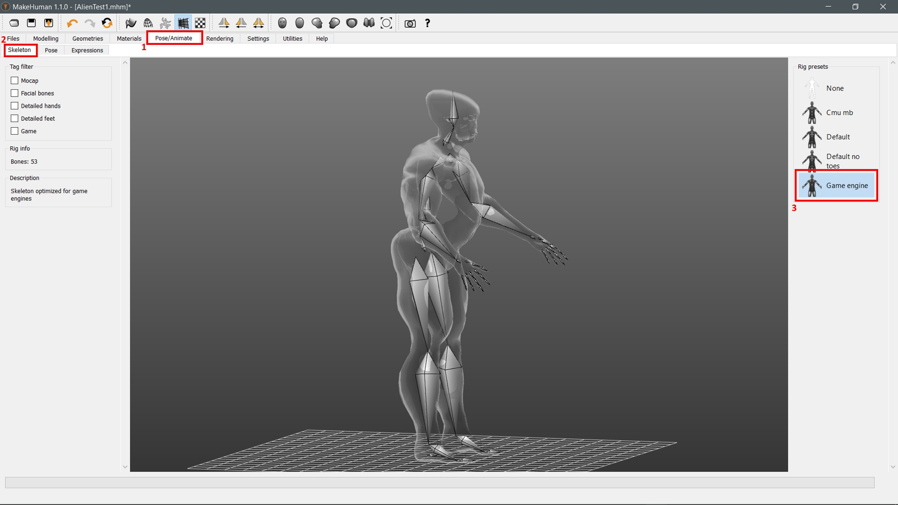

## 01.1

Select Tab "Pose/Animate"

## 01.2

In "Pose/Animate": Select Tab "Skeleton"

## 01.3

Select Rig Preset "Game Engine"

# 02 - MakeHuman

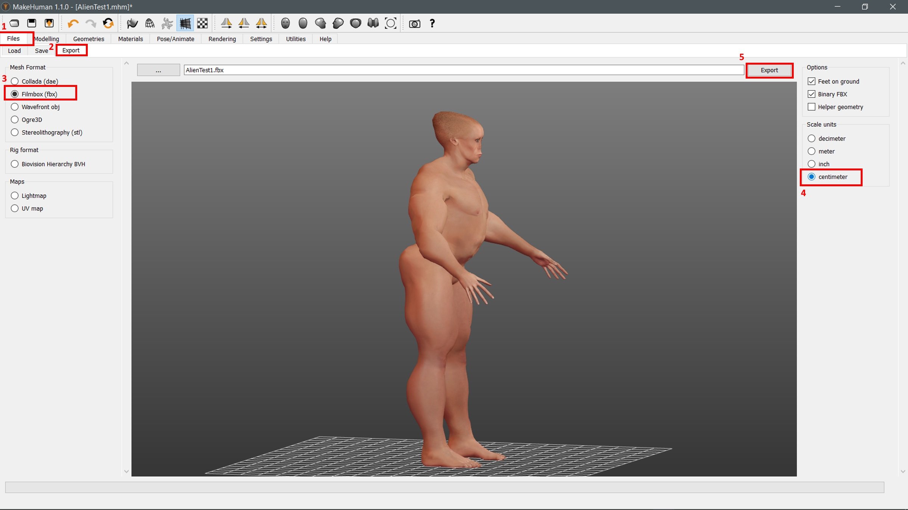

## 02.1

Select Tab "Files"

## 02.2

In "Files": Select Tab "Export"

## 02.3

Select Mesh Format: Filmbox (fbx)

## 02.4

Select Scale Unit: centimeter

## 02.5

Click "Export"

# 03 - Unreal Engine

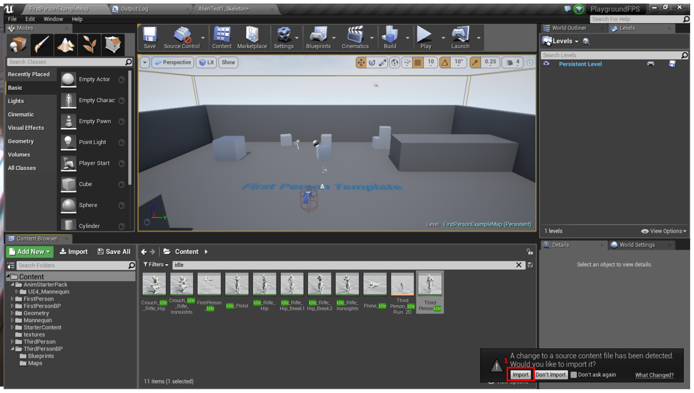

## 03.1

On source file change detection: Click "Import" (in upcoming Window "Import all")

# 04 - Unreal Engine

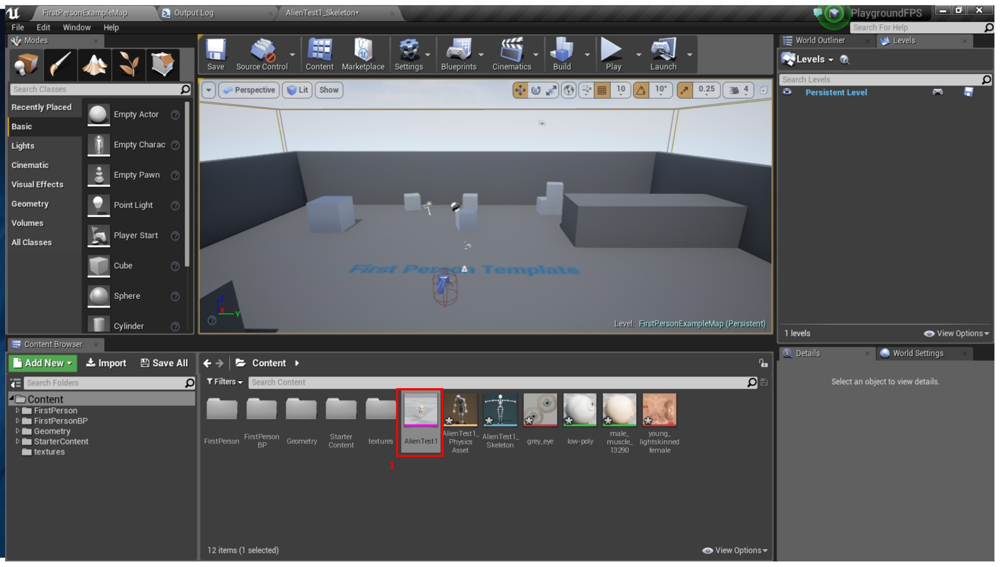

## 04.1

Open imported Skeletal Mesh

# 05 - Unreal Engine

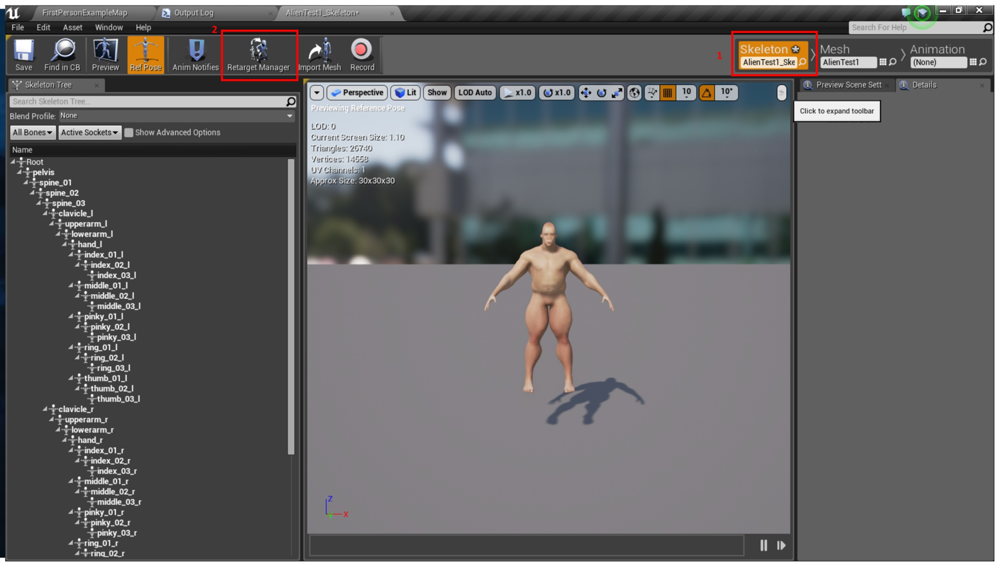

## 05.1

Open Skeleton Editor

## 05.2

Click "Retarget Manager"

# 06 - Unreal Engine

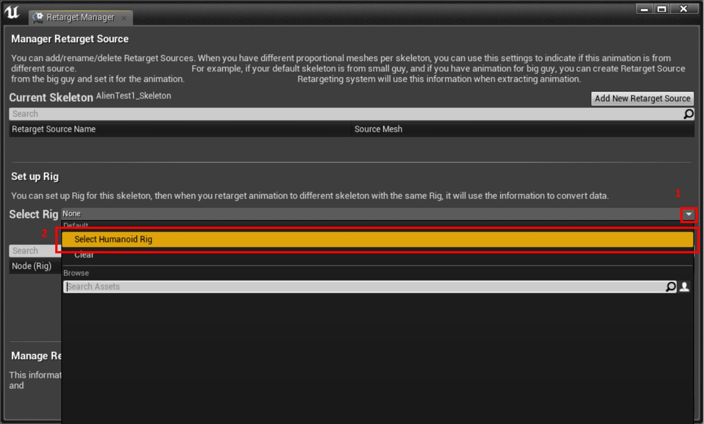

## 06.1

Open Drop Down "Select Rig"

## 06.2

Select "Select Humanoid Rig"

# 07 - Unreal Engine

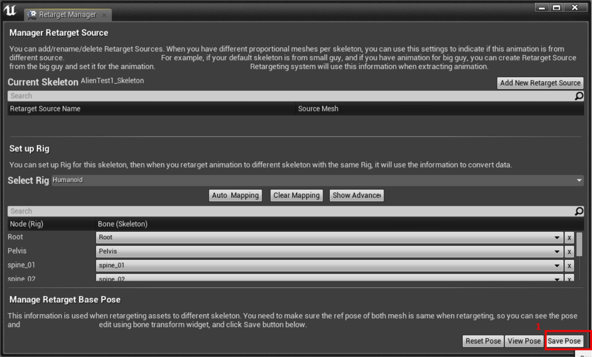

## 07.1

Click "Save Pose" (Bones from MH are named same as the ones in UE => no change needed)

# 08 - Unreal Engine

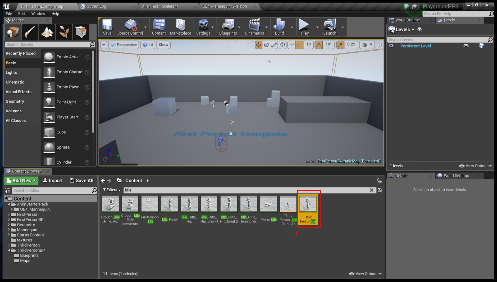

## 08.1

Open Animation you want to retarget

# 09 - Unreal Engine

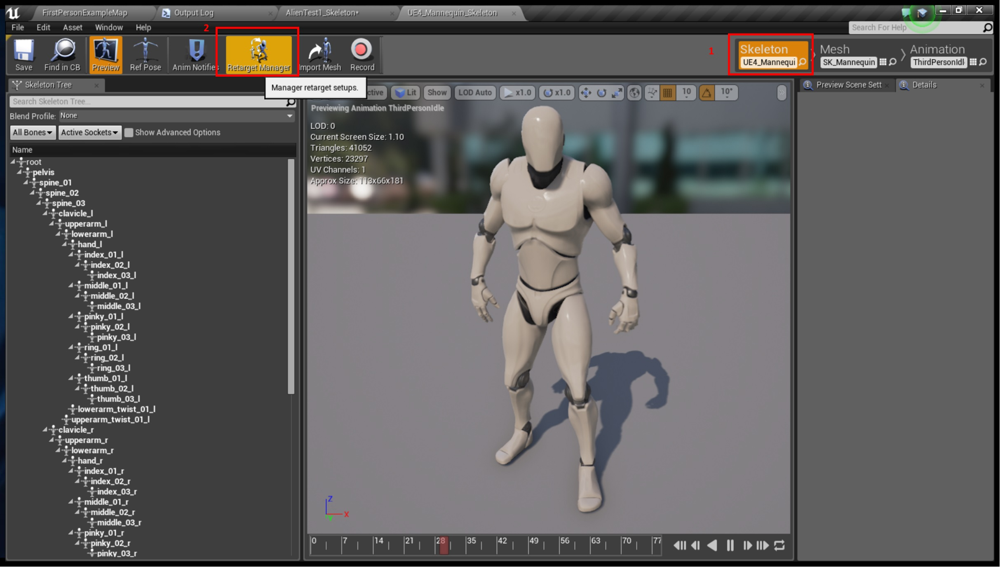

## 09.1

Open Skeleton Editor

## 09.2

Click "Retarget Manager"

# 10 - Unreal Engine

## 10.1

Open Drop Down "Select Rig"

## 10.2

Select "Select Humanoid Rig"

# 11 - Unreal Engine

## 11.1

Click "Save Pose"

# 12 - Unreal Engine

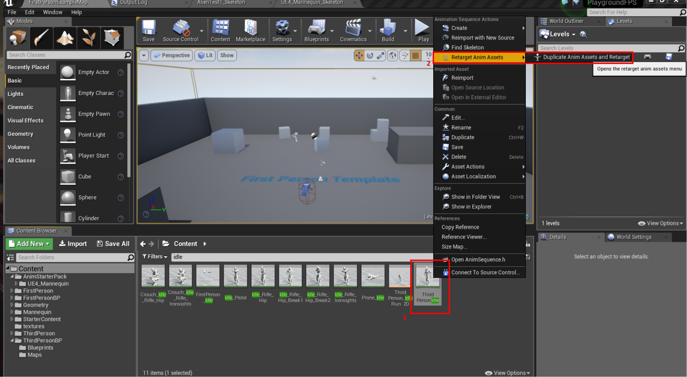

## 12.1 

Right Click Animation you want to retarget

## 12.2

Select "Retarget Anim Asset" => "Duplicate Anmim Assets and Retarget"

# 13 - Unreal Engine

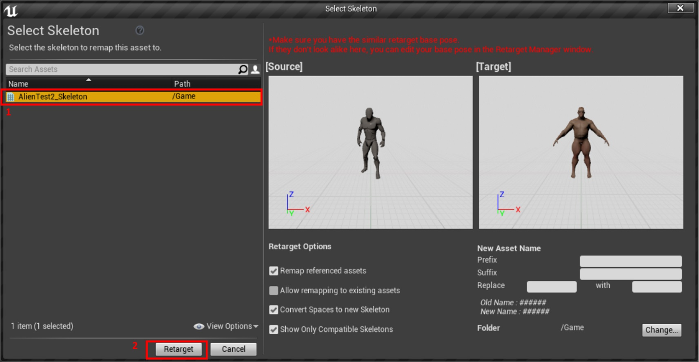

## 13.1

Select your target Skeleton

## 13.2

Click "Retarget"

# 14 - Unreal Engine

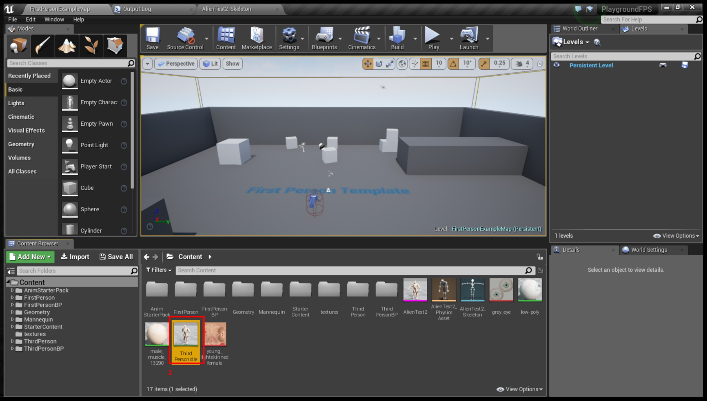

## 14.1

Open the new Anim Asset next to your target Skeleton

# 15 - Unreal Engine

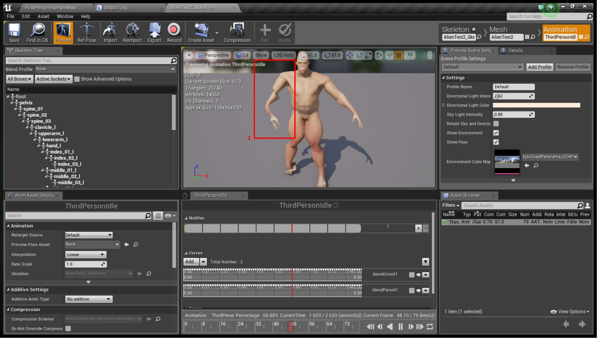

There might be Glitches in the Animation. To fix them:

# 16 - Unreal Engine

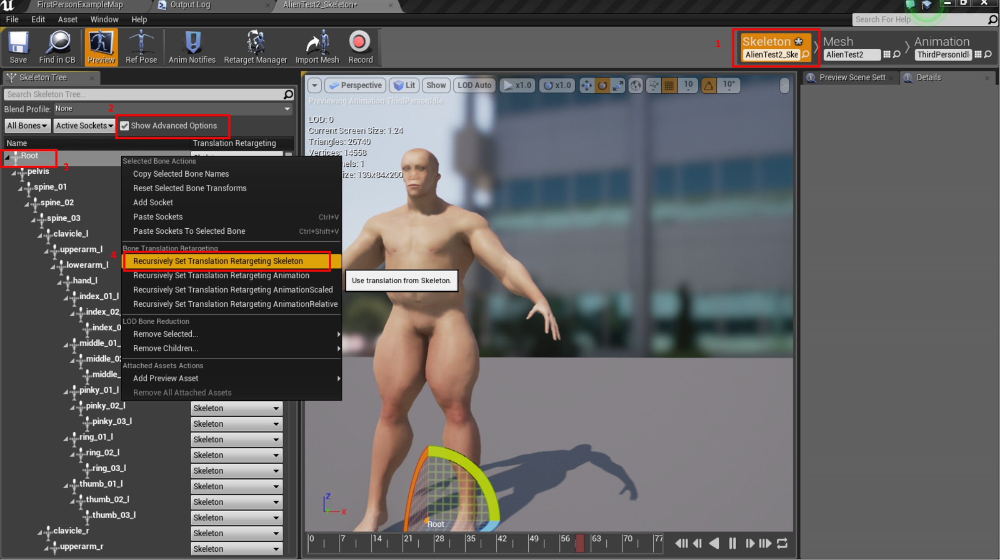

## 16.1 

Open Skeleton Editor

## 16.2

Make sure Box next to "Show Advanced Options" is checked

## 16.3

Right click the "Root" bone of your Skeleton (or the broken one itself if you want to go step by step)

## 16.4

Click "Recursively Set Translation Retargeting Skeleton" in upcoming menu

# 17 - Unreal Engine

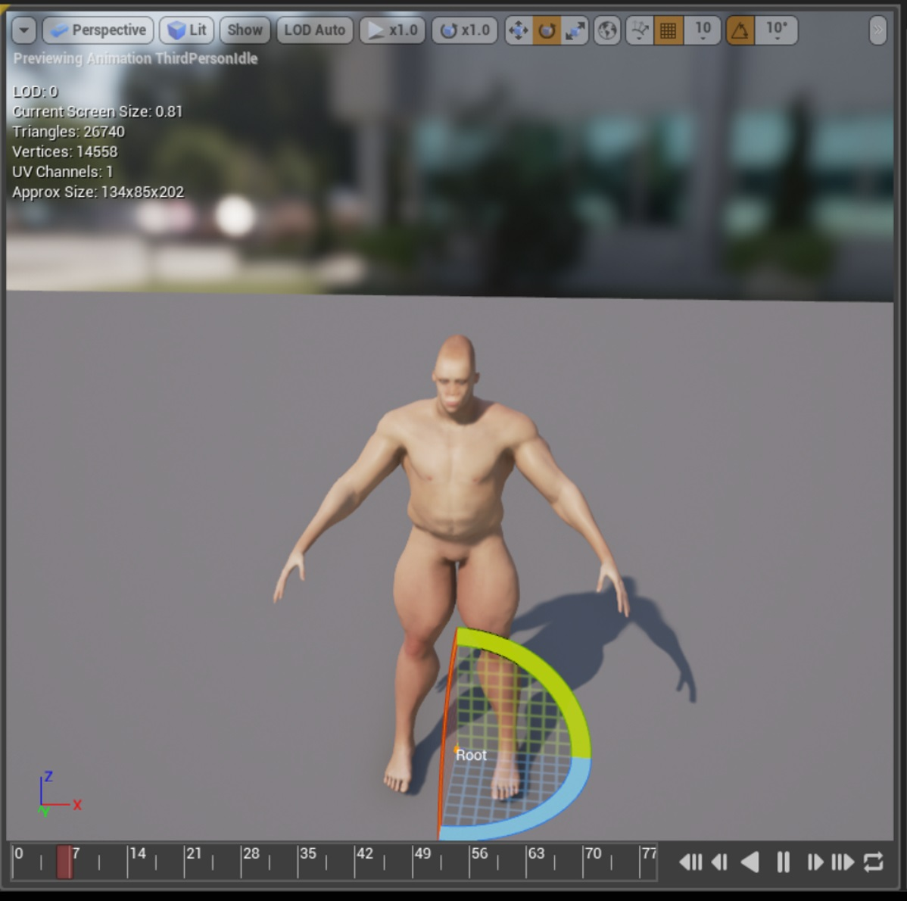

The final result without Glitches

